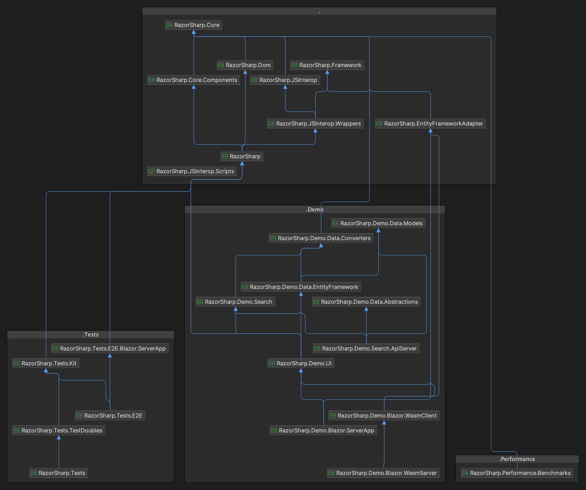

# RazorSharp

Welcome to the RazorSharp project! This directory contains the source code for the RazorSharp library.

## Core Class Library

### RazorSharp
- Implements the Razor components class library.
- Produces the assembly `RazorSharp.Components`.

### RazorSharp.Core
- Provides general-purpose C# types.

### RazorSharp.Core.Components
- Offers C# types specific to Razor components.

### RazorSharp.Dom
- Contains types associated with the Document Object Model (DOM).

### RazorSharp.EntityFrameworkAdapter
- Provides specialized asynchronous support for `IQueryable<T>` by leveraging Entity Framework Core extensions.

### RazorSharp.Framework
- Provides infrastructure and framework-level types for [RazorSharp](#razorsharp).

### RazorSharp.JSInterop
- Includes types for interoperability between JavaScript and C#.

### RazorSharp.JSInterop.Scripts
- Contains TypeScript source files, whose output is copied to [RazorSharp](#razorsharp) when the solution is built.

### RazorSharp.JSInterop.Wrappers
- Provides C# wrapper types for `RazorSharp.JSInterop.Scripts`.

## Demo

### RazorSharp.Demo.UI
- Demonstrates how to author [RazorSharp](#razorsharp) components and pages using Razor components.

### RazorSharp.Demo.Blazor.ServerApp
- Renders [RazorSharp](#razorsharp) components from `RazorSharp.Demo.UI` on the server.

### RazorSharp.Demo.Blazor.WasmClient
- Renders [RazorSharp](#razorsharp) components from `RazorSharp.Demo.UI` on the client.

### RazorSharp.Demo.Blazor.WasmServer
- Serves the `RazorSharp.Demo.Blazor.WasmClient` application to the browser.

### RazorSharp.Demo.Search.DataServer
- Serves data through Web APIs for the Search demo.

### RazorSharp.Demo.Data.EntityFramework
- Sets up the configuration for the Entity Framework and Sqlite to be used by the demo.

## Tests

### RazorSharp.Tests
- Contains unit tests for the [Core Class Library](#core-class-library).

Feel free to explore the various components of this project and contribute to its development!