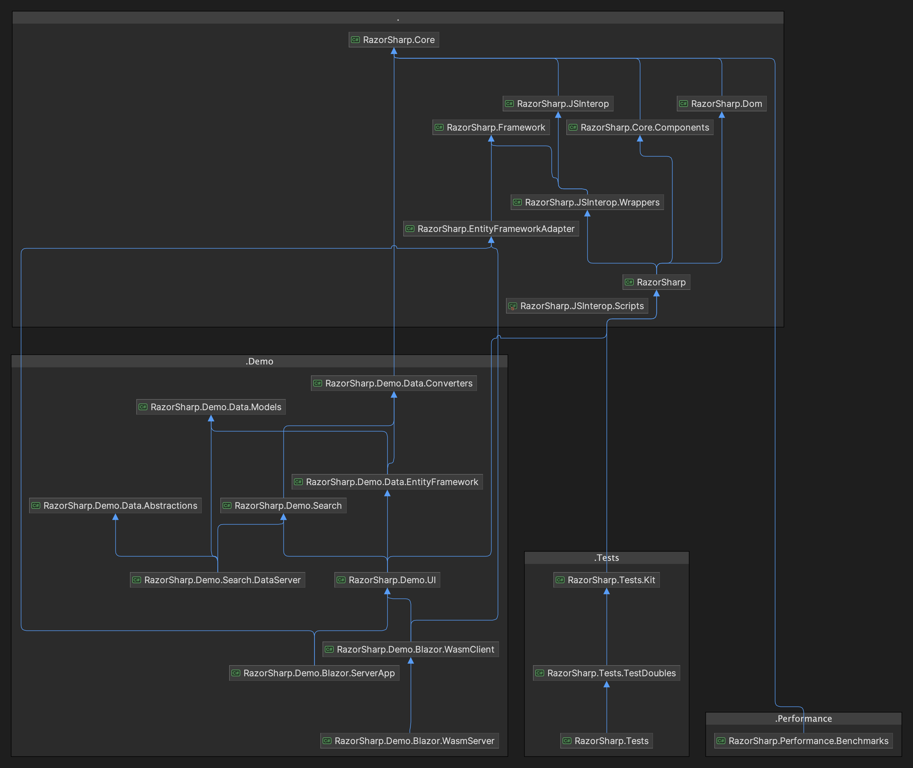

# RazorSharp

Welcome to the RazorSharp project! This directory contains the source code for the RazorSharp library.

## Core Class Library

### RazorSharp
- Implements the Razor components class library.
- Produces the assembly `RazorSharp.Components`.

### RazorSharp.Core
- Provides general-purpose C# types.

### RazorSharp.Core.Components
- Offers C# types specific to Razor components.

### RazorSharp.Dom
- Contains types associated with the Document Object Model (DOM).

### RazorSharp.Framework
- Provides infrastructure and framework-level types for [RazorSharp](#razorsharp).

### RazorSharp.JSInterop
- Includes types for interoperability between JavaScript and C#.

### RazorSharp.JSInterop.Scripts
- Contains TypeScript source files, whose output is copied to [RazorSharp](#razorsharp) when the solution is built.

### RazorSharp.JSInterop.Wrappers
- Provides C# wrapper types for `RazorSharp.JSInterop.Scripts`.

## Demo

### RazorSharp.Demo.UI
- Demonstrates how to author [RazorSharp](#razorsharp) components and pages using Razor components.

### RazorSharp.Demo.Data.ApiServer
- Serves data through Web APIs for the demo.

### RazorSharp.Demo.Blazor.AppServer
- Renders [RazorSharp](#razorsharp) components from `RazorSharp.Demo.UI` on the server.

### RazorSharp.Demo.Blazor.WasmApp
- Renders [RazorSharp](#razorsharp) components from `RazorSharp.Demo.UI` on the client.

### RazorSharp.Demo.Blazor.WasmAppServer
- Serves the `RazorSharp.Demo.Blazor.WasmApp` application to the browser.

## Tests

### RazorSharp.Tests
- Contains unit tests for the [Core Class Library](#core-class-library).

### RazorSharp.Tests.E2E
- Hosts End-to-End (E2E) tests for the [Core Class Library](#core-class-library).

### RazorSharp.Tests.E2E.Blazor.AppServer
- Serves as the E2E testing server for `RazorSharp.Tests.E2E`.

Feel free to explore the various components of this project and contribute to its development!